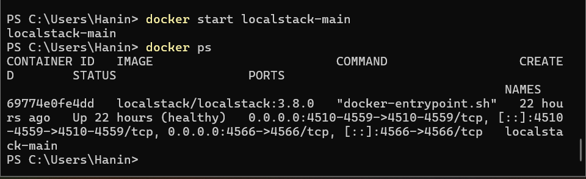
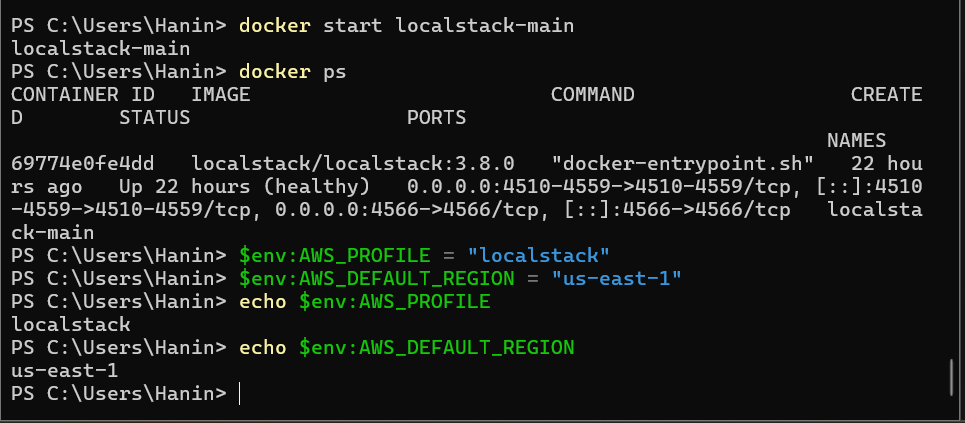
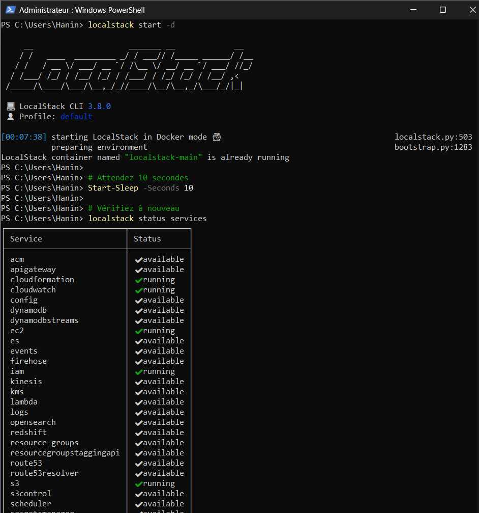
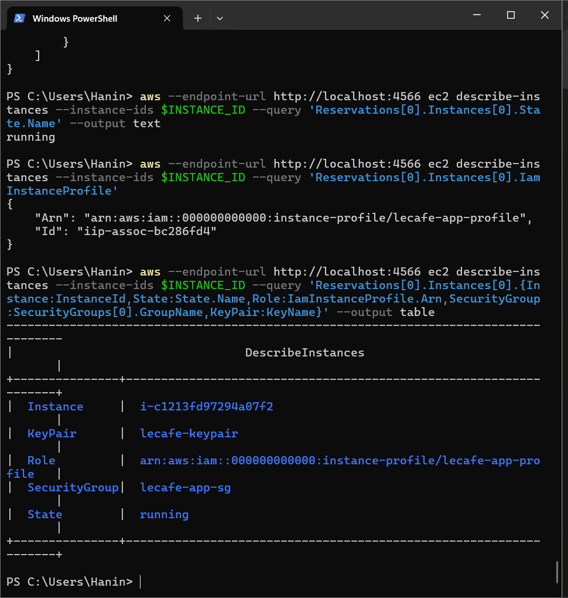
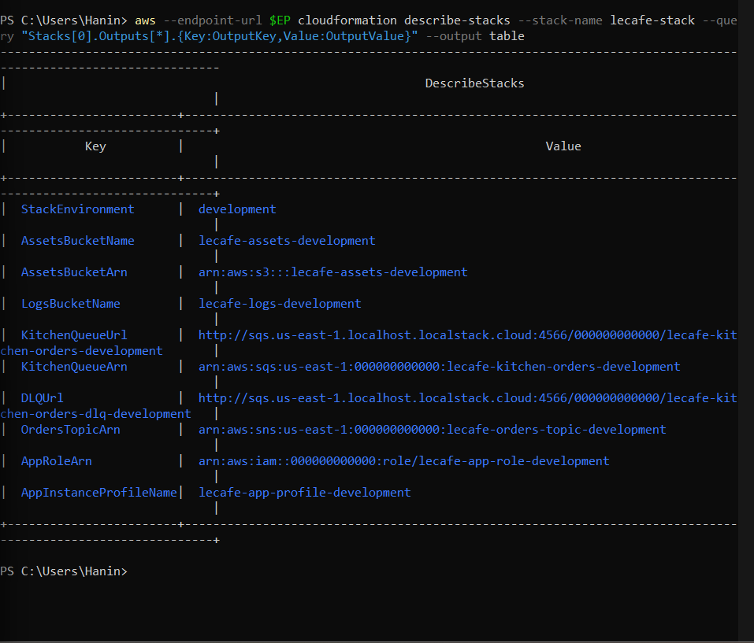
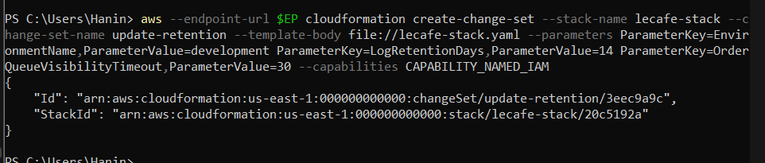
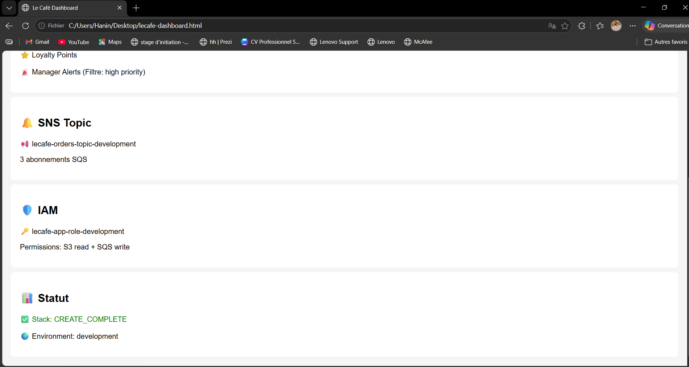

# ☕ Le Café — AWS Hands-On Labs avec LocalStack
### Rapport de TP complet | Labs 00 → 05 | Windows PowerShell

---

## 📋 Table des matières

- [Environnement de travail](#environnement-de-travail)
- [Lab 00 — Découverte de LocalStack](#lab-00--découverte-de-localstack)
- [Lab 01 — IAM : Identity and Access Management](#lab-01--iam--identity-and-access-management)
- [Lab 02 — *(référence)* S3 en profondeur](#lab-02--référence-s3-en-profondeur)
- [Lab 03 — EC2 : Compute, Key Pairs, Security Groups](#lab-03--ec2--compute-key-pairs-security-groups)
- [Lab 04 — SQS & SNS : Messaging et architecture événementielle](#lab-04--sqs--sns--messaging-et-architecture-événementielle)
- [Lab 05 — Infrastructure as Code : CloudFormation](#lab-05--infrastructure-as-code--cloudformation)
- [Bilan des compétences acquises](#bilan-des-compétences-acquises)

---

## Environnement de travail

| Outil | Version | Rôle |
|-------|---------|------|
| Windows 11 | 10.0.26200 | OS |
| PowerShell | 5.1+ | Shell principal |
| Docker Desktop | 28.5.1 | Moteur de conteneurs |
| LocalStack Community | 3.8.0 | Émulateur AWS local |
| AWS CLI v2 | 2.34.50 | Interface ligne de commande AWS |
| Python | 3.11 | Runtime LocalStack CLI |

**Variables d'environnement PowerShell (à définir à chaque session) :**
```powershell
$env:AWS_PROFILE = "localstack"
$env:AWS_DEFAULT_REGION = "us-east-1"
```

**Profil AWS configuré (`aws configure --profile localstack`) :**
```
AWS Access Key ID     : test
AWS Secret Access Key : test
Default region        : us-east-1
Output format         : json
```

---

## Lab 00 — Découverte de LocalStack

### Objectif
Installer et configurer un environnement AWS local complet, puis interagir avec S3, IAM et SQS sans compte AWS réel.

### Concept clé
LocalStack émule l'API AWS sur `http://localhost:4566`. Chaque commande `aws --endpoint-url http://localhost:4566` est un vrai appel API AWS, juste redirigé vers l'émulateur local.

---

### Étape 1 — Lancer LocalStack via Docker

```bash
docker run -d --name localstack-main \
  -p 4566:4566 \
  -p 4510-4559:4510-4559 \
  localstack/localstack:3.8.0
```

**Commande de vérification :**
```bash
docker ps
curl http://localhost:4566/_localstack/health
```



---

### Étape 2 — Configurer le profil AWS

```powershell
aws configure --profile localstack
# Valeurs : test / test / us-east-1 / json
set AWS_PROFILE=localstack
```

---

### Étape 3 — Créer un bucket S3

```bash
aws --endpoint-url http://localhost:4566 s3 mb s3://lecafe-menus
aws --endpoint-url http://localhost:4566 s3 ls
```

**Commande de vérification :**
```bash
aws --endpoint-url http://localhost:4566 s3 ls
```





### Étape 4 — Upload et download S3 (round-trip)

```powershell
echo "Espresso: 2.50 - Latte: 3.50 - Croissant: 2.00" > menu.txt
aws --endpoint-url http://localhost:4566 s3 cp menu.txt s3://lecafe-menus/menu-paris.txt
aws --endpoint-url http://localhost:4566 s3 cp s3://lecafe-menus/menu-paris.txt menu-downloaded.txt
type menu-downloaded.txt
```

**Commande de vérification :**
```bash
aws --endpoint-url http://localhost:4566 s3 ls s3://lecafe-menus/
type menu-downloaded.txt
```




### Étape 5 — Créer un utilisateur IAM

```bash
aws --endpoint-url http://localhost:4566 iam create-user --user-name lecafe-app
aws --endpoint-url http://localhost:4566 iam attach-user-policy \
  --user-name lecafe-app \
  --policy-arn arn:aws:iam::aws:policy/AmazonS3ReadOnlyAccess
```

**Commande de vérification :**
```bash
aws --endpoint-url http://localhost:4566 iam list-attached-user-policies --user-name lecafe-app
```




### Étape 6 — Créer une queue SQS et envoyer un message

```bash
aws --endpoint-url http://localhost:4566 sqs create-queue --queue-name lecafe-orders
aws --endpoint-url http://localhost:4566 sqs send-message \
  --queue-url http://localhost:4566/000000000000/lecafe-orders \
  --message-body '{"item": "Latte", "size": "large", "table": 7}'
aws --endpoint-url http://localhost:4566 sqs receive-message \
  --queue-url http://localhost:4566/000000000000/lecafe-orders
```

**Commande de vérification :**
```bash
aws --endpoint-url http://localhost:4566 sqs receive-message \
  --queue-url http://localhost:4566/000000000000/lecafe-orders
```

> 📸 **CAPTURE D'ÉCRAN 5**
> La réponse JSON affiche le `Body` : `{"item": "Latte", "size": "large", "table": 7}` avec un `ReceiptHandle`

---

### Étape 7 — Consulter les logs LocalStack

```bash
docker logs localstack-main --tail 50
```


## Lab 01 — IAM : Identity and Access Management

### Objectif
Construire une structure IAM complète pour Le Café : utilisateurs, groupes, policies custom en JSON, et un rôle de service avec credentials temporaires.

### Concept clé
**Users → Groups → Policies** est le seul pattern correct. Jamais de policy directement sur un user. Un rôle IAM génère des credentials temporaires via STS — plus sûr que des access keys permanentes.

---

### Étape 1 — Créer les utilisateurs et groupes

```bash
aws --endpoint-url http://localhost:4566 iam create-user --user-name alice
aws --endpoint-url http://localhost:4566 iam create-user --user-name bob
aws --endpoint-url http://localhost:4566 iam create-user --user-name charlie
aws --endpoint-url http://localhost:4566 iam create-group --group-name cafe-developers
aws --endpoint-url http://localhost:4566 iam create-group --group-name cafe-operations
aws --endpoint-url http://localhost:4566 iam add-user-to-group --user-name alice --group-name cafe-developers
aws --endpoint-url http://localhost:4566 iam add-user-to-group --user-name bob --group-name cafe-developers
aws --endpoint-url http://localhost:4566 iam add-user-to-group --user-name charlie --group-name cafe-operations
```

**Commande de vérification :**
```bash
aws --endpoint-url http://localhost:4566 iam get-group --group-name cafe-developers
```


### Étape 2 — Créer les policies JSON custom

```powershell
# Policy développeurs (S3 read/write sur lecafe-assets uniquement)
$policy = '{"Version":"2012-10-17","Statement":[{"Sid":"AllowS3BucketListing","Effect":"Allow","Action":["s3:ListBucket"],"Resource":"arn:aws:s3:::lecafe-assets"},{"Sid":"AllowS3ObjectOperations","Effect":"Allow","Action":["s3:GetObject","s3:PutObject","s3:DeleteObject"],"Resource":"arn:aws:s3:::lecafe-assets/*"}]}'
[System.IO.File]::WriteAllText("$PWD\developer-s3-policy.json", $policy)

aws --endpoint-url http://localhost:4566 iam create-policy \
  --policy-name LeCafe-Developer-S3 \
  --policy-document file://developer-s3-policy.json
```

**Commande de vérification :**
```bash
aws --endpoint-url http://localhost:4566 iam get-policy-version \
  --policy-arn arn:aws:iam::000000000000:policy/LeCafe-Developer-S3 \
  --version-id v1
```

---

### Étape 3 — Attacher les policies aux groupes

```bash
aws --endpoint-url http://localhost:4566 iam attach-group-policy \
  --group-name cafe-developers \
  --policy-arn arn:aws:iam::000000000000:policy/LeCafe-Developer-S3
aws --endpoint-url http://localhost:4566 iam attach-group-policy \
  --group-name cafe-operations \
  --policy-arn arn:aws:iam::000000000000:policy/LeCafe-Operations-ReadOnly
```

**Commande de vérification :**
```bash
aws --endpoint-url http://localhost:4566 iam list-attached-group-policies --group-name cafe-developers
aws --endpoint-url http://localhost:4566 iam list-attached-group-policies --group-name cafe-operations
```


---

### Étape 4 — Créer le rôle de service et simuler STS AssumeRole

```powershell
# Trust policy
$trust = '{"Version":"2012-10-17","Statement":[{"Effect":"Allow","Principal":{"Service":"ec2.amazonaws.com"},"Action":"sts:AssumeRole"}]}'
[System.IO.File]::WriteAllText("$PWD\trust-policy.json", $trust)

aws --endpoint-url http://localhost:4566 iam create-role \
  --role-name lecafe-app-role \
  --assume-role-policy-document file://trust-policy.json

aws --endpoint-url http://localhost:4566 sts assume-role \
  --role-arn arn:aws:iam::000000000000:role/lecafe-app-role \
  --role-session-name ordering-app-session
```

**Commande de vérification :**
```bash
aws --endpoint-url http://localhost:4566 sts assume-role \
  --role-arn arn:aws:iam::000000000000:role/lecafe-app-role \
  --role-session-name ordering-app-session
```


---

## Lab 02 — *(référence)* S3 en profondeur

> ℹ️ Le Lab 02 (versioning S3, bucket policies, lifecycle rules, static website) fait partie de la série mais n'a pas été réalisé dans ce TP. Les concepts S3 de base ont été couverts dans le Lab 00, et S3 est utilisé comme ressource support dans les Labs 01, 03, 04 et 05.

---

## Lab 03 — EC2 : Compute, Key Pairs, Security Groups

### Objectif
Provisionner l'infrastructure compute pour l'app Le Café : paire de clés SSH, security group (firewall virtuel), instance profile IAM, et instance EC2 attachée au rôle du Lab 01.

### Concept clé
L'instance EC2 + l'instance profile IAM = l'application s'authentifie à AWS **sans aucune clé dans le code**. Le metadata service (169.254.169.254) fournit les credentials temporaires automatiquement.

---

### Étape 1 — Créer la paire de clés SSH

```bash
aws --endpoint-url http://localhost:4566 ec2 create-key-pair \
  --key-name lecafe-keypair \
  --query 'KeyMaterial' \
  --output text > lecafe-keypair.pem
```

**Commande de vérification :**
```bash
aws --endpoint-url http://localhost:4566 ec2 describe-key-pairs
```


### Étape 2 — Créer le Security Group

```powershell
$VPC_ID = (aws --endpoint-url http://localhost:4566 ec2 describe-vpcs \
  --filters "Name=isDefault,Values=true" \
  --query 'Vpcs[0].VpcId' --output text)

$SG_ID = (aws --endpoint-url http://localhost:4566 ec2 create-security-group \
  --group-name lecafe-app-sg \
  --description "Security group for Le Cafe ordering app" \
  --vpc-id $VPC_ID --query 'GroupId' --output text)

aws --endpoint-url http://localhost:4566 ec2 authorize-security-group-ingress \
  --group-id $SG_ID --protocol tcp --port 80 --cidr 0.0.0.0/0
aws --endpoint-url http://localhost:4566 ec2 authorize-security-group-ingress \
  --group-id $SG_ID --protocol tcp --port 443 --cidr 0.0.0.0/0
aws --endpoint-url http://localhost:4566 ec2 authorize-security-group-ingress \
  --group-id $SG_ID --protocol tcp --port 22 --cidr 0.0.0.0/0
```

**Commande de vérification :**
```bash
aws --endpoint-url http://localhost:4566 ec2 describe-security-groups --group-ids $SG_ID
```

---

### Étape 3 — Créer l'instance profile et lancer l'instance EC2

```bash
aws --endpoint-url http://localhost:4566 iam create-instance-profile \
  --instance-profile-name lecafe-app-profile
aws --endpoint-url http://localhost:4566 iam add-role-to-instance-profile \
  --instance-profile-name lecafe-app-profile \
  --role-name lecafe-app-role

$INSTANCE_ID = (aws --endpoint-url http://localhost:4566 ec2 run-instances \
  --image-id ami-0c02fb55956c7d316 \
  --instance-type t3.micro \
  --key-name lecafe-keypair \
  --security-group-ids $SG_ID \
  --iam-instance-profile Name=lecafe-app-profile \
  --tag-specifications 'ResourceType=instance,Tags=[{Key=Name,Value=lecafe-app-server}]' \
  --count 1 \
  --query 'Instances[0].InstanceId' --output text)
```

**Commande de vérification :**
```bash
aws --endpoint-url http://localhost:4566 ec2 describe-instances \
  --instance-ids $INSTANCE_ID \
  --query 'Reservations[0].Instances[0].{Instance:InstanceId,State:State.Name,Role:IamInstanceProfile.Arn,SecurityGroup:SecurityGroups[0].GroupName,KeyPair:KeyName}' \
  --output table
```



---

### Étape 4 — Tester le cycle de vie Stop/Start

```bash
aws --endpoint-url http://localhost:4566 ec2 stop-instances --instance-ids $INSTANCE_ID
aws --endpoint-url http://localhost:4566 ec2 describe-instances \
  --instance-ids $INSTANCE_ID \
  --query 'Reservations[0].Instances[0].State.Name' --output text
aws --endpoint-url http://localhost:4566 ec2 start-instances --instance-ids $INSTANCE_ID
```

**Commande de vérification :**
```bash
aws --endpoint-url http://localhost:4566 ec2 describe-instances \
  --instance-ids $INSTANCE_ID \
  --query 'Reservations[0].Instances[0].State.Name' --output text
```


---

## Lab 04 — SQS & SNS : Messaging et architecture événementielle

### Objectif
Construire un pipeline de commandes événementiel : queue SQS avec DLQ, queue FIFO pour les paiements, topic SNS avec fan-out vers 3 queues downstream.

### Concept clé
**SQS** = file point-à-point (1 message → 1 consommateur). **SNS** = broadcast pub/sub (1 message → N copies). **Fan-out** = SNS + SQS combinés : l'app publie une fois, chaque système downstream reçoit sa propre copie indépendamment.

---

### Étape 1 — Créer la queue cuisine + Dead Letter Queue

```bash
aws --endpoint-url http://localhost:4566 sqs create-queue --queue-name lecafe-kitchen-orders
aws --endpoint-url http://localhost:4566 sqs create-queue --queue-name lecafe-kitchen-orders-dlq
```

```powershell
$KITCHEN_QUEUE_URL = (aws --endpoint-url http://localhost:4566 sqs get-queue-url \
  --queue-name lecafe-kitchen-orders --query 'QueueUrl' --output text)
$DLQ_URL = (aws --endpoint-url http://localhost:4566 sqs get-queue-url \
  --queue-name lecafe-kitchen-orders-dlq --query 'QueueUrl' --output text)
$DLQ_ARN = (aws --endpoint-url http://localhost:4566 sqs get-queue-attributes \
  --queue-url $DLQ_URL --attribute-names QueueArn \
  --query 'Attributes.QueueArn' --output text)
```

**Commande de vérification :**
```bash
aws --endpoint-url http://localhost:4566 sqs get-queue-attributes \
  --queue-url $KITCHEN_QUEUE_URL \
  --attribute-names All
```


---

### Étape 2 — Envoyer et consommer des messages SQS

```bash
aws --endpoint-url http://localhost:4566 sqs send-message \
  --queue-url $KITCHEN_QUEUE_URL \
  --message-body '{"orderId":"ORD-001","table":4,"totalAmount":3.50}'
```

```powershell
$MSG = (aws --endpoint-url http://localhost:4566 sqs receive-message \
  --queue-url $KITCHEN_QUEUE_URL --max-number-of-messages 1)
$RECEIPT = ($MSG | ConvertFrom-Json).Messages[0].ReceiptHandle
aws --endpoint-url http://localhost:4566 sqs delete-message \
  --queue-url $KITCHEN_QUEUE_URL --receipt-handle $RECEIPT
```

**Commande de vérification :**
```bash
aws --endpoint-url http://localhost:4566 sqs get-queue-attributes \
  --queue-url $KITCHEN_QUEUE_URL \
  --attribute-names ApproximateNumberOfMessages \
  --query 'Attributes.ApproximateNumberOfMessages' --output text
```


---

### Étape 3 — Créer la queue FIFO pour les paiements

```powershell
[System.IO.File]::WriteAllText("$PWD\fifo-attrs.json", '{"FifoQueue":"true","ContentBasedDeduplication":"true"}')
aws --endpoint-url http://localhost:4566 sqs create-queue \
  --queue-name lecafe-payments.fifo \
  --attributes file://fifo-attrs.json
```

**Commande de vérification :**
```bash
aws --endpoint-url http://localhost:4566 sqs get-queue-url \
  --queue-name lecafe-payments.fifo --query 'QueueUrl' --output text
```

---

### Étape 4 — Créer le topic SNS et abonner les 3 queues

```bash
$TOPIC_ARN = (aws --endpoint-url http://localhost:4566 sns create-topic \
  --name lecafe-orders-topic --query 'TopicArn' --output text)

aws --endpoint-url http://localhost:4566 sns subscribe \
  --topic-arn $TOPIC_ARN --protocol sqs --notification-endpoint $INVENTORY_ARN
aws --endpoint-url http://localhost:4566 sns subscribe \
  --topic-arn $TOPIC_ARN --protocol sqs --notification-endpoint $LOYALTY_ARN
aws --endpoint-url http://localhost:4566 sns subscribe \
  --topic-arn $TOPIC_ARN --protocol sqs --notification-endpoint $MANAGER_ARN
```

**Commande de vérification :**
```bash
aws --endpoint-url http://localhost:4566 sns list-subscriptions-by-topic \
  --topic-arn $TOPIC_ARN
```


---

### Étape 5 — Tester le fan-out SNS → SQS

```powershell
[System.IO.File]::WriteAllText("$PWD\msg-attrs-high.json", '{"Priority":{"DataType":"String","StringValue":"high"}}')
aws --endpoint-url http://localhost:4566 sns publish \
  --topic-arn $TOPIC_ARN \
  --message '{"orderId":"ORD-100","table":12,"totalAmount":39.00}' \
  --message-attributes file://msg-attrs-high.json \
  --subject "New Le Cafe Order"
```

**Commande de vérification :**
```bash
aws --endpoint-url http://localhost:4566 sqs get-queue-attributes \
  --queue-url $INVENTORY_URL \
  --attribute-names ApproximateNumberOfMessages \
  --query 'Attributes.ApproximateNumberOfMessages' --output text

aws --endpoint-url http://localhost:4566 sqs get-queue-attributes \
  --queue-url $LOYALTY_URL \
  --attribute-names ApproximateNumberOfMessages \
  --query 'Attributes.ApproximateNumberOfMessages' --output text

aws --endpoint-url http://localhost:4566 sqs get-queue-attributes \
  --queue-url $MANAGER_URL \
  --attribute-names ApproximateNumberOfMessages \
  --query 'Attributes.ApproximateNumberOfMessages' --output text
```

---

## Lab 05 — Infrastructure as Code : CloudFormation

### Objectif
Exprimer l'intégralité du stack Le Café (IAM + S3 + SQS + SNS) en un seul fichier YAML CloudFormation. Déployer, mettre à jour via change set, et supprimer en une seule commande.

### Concept clé
**Impératif** (Labs 00-04) = "crée cette ressource maintenant". **Déclaratif** (CloudFormation) = "je veux que ces ressources existent". CloudFormation compare l'état désiré à l'état réel et applique les changements nécessaires dans le bon ordre automatiquement.

---

### Étape 1 — Créer le template YAML

```powershell
mkdir $HOME/lecafe-iac
# Créer lecafe-stack.yaml avec le contenu complet du template
[System.IO.File]::WriteAllText("$HOME\lecafe-iac\lecafe-stack.yaml", $templateContent)
```

**Commande de vérification :**
```bash
Get-Content $HOME\lecafe-iac\lecafe-stack.yaml | Select-Object -First 5
```

> 📸 **CAPTURE D'ÉCRAN 20**
> Les premières lignes du fichier affichent `AWSTemplateFormatVersion: "2010-09-09"` et `Description: Le Cafe complete infrastructure stack.`

---

### Étape 2 — Valider le template

```bash
aws --endpoint-url http://localhost:4566 cloudformation validate-template \
  --template-body file://$HOME/lecafe-iac/lecafe-stack.yaml
```

**Commande de vérification :**
```bash
# La commande validate-template EST la vérification
aws --endpoint-url http://localhost:4566 cloudformation validate-template \
  --template-body file://$HOME/lecafe-iac/lecafe-stack.yaml
```

---

### Étape 3 — Déployer le stack

```bash
aws --endpoint-url http://localhost:4566 cloudformation create-stack \
  --stack-name lecafe-stack \
  --template-body file://$HOME/lecafe-iac/lecafe-stack.yaml \
  --parameters \
    ParameterKey=EnvironmentName,ParameterValue=development \
    ParameterKey=LogRetentionDays,ParameterValue=30 \
    ParameterKey=OrderQueueVisibilityTimeout,ParameterValue=30 \
  --capabilities CAPABILITY_NAMED_IAM
```

**Commande de vérification :**
```bash
aws --endpoint-url http://localhost:4566 cloudformation describe-stacks \
  --stack-name lecafe-stack \
  --query 'Stacks[0].StackStatus' --output text
```

---

### Étape 4 — Inspecter les ressources et les outputs

```bash
aws --endpoint-url http://localhost:4566 cloudformation list-stack-resources \
  --stack-name lecafe-stack \
  --query 'StackResourceSummaries[*].{Type:ResourceType,LogicalId:LogicalResourceId,Status:ResourceStatus}' \
  --output table

aws --endpoint-url http://localhost:4566 cloudformation describe-stacks \
  --stack-name lecafe-stack \
  --query 'Stacks[0].Outputs[*].{Key:OutputKey,Value:OutputValue}' \
  --output table
```

**Commande de vérification :**
```bash
aws --endpoint-url http://localhost:4566 cloudformation list-stack-resources \
  --stack-name lecafe-stack \
  --query 'StackResourceSummaries[*].{Type:ResourceType,LogicalId:LogicalResourceId,Status:ResourceStatus}' \
  --output table
```

---

### Étape 5 — Mettre à jour via Change Set

```bash
aws --endpoint-url http://localhost:4566 cloudformation create-change-set \
  --stack-name lecafe-stack \
  --change-set-name update-retention \
  --template-body file://$HOME/lecafe-iac/lecafe-stack.yaml \
  --parameters \
    ParameterKey=EnvironmentName,ParameterValue=development \
    ParameterKey=LogRetentionDays,ParameterValue=14 \
    ParameterKey=OrderQueueVisibilityTimeout,ParameterValue=30 \
  --capabilities CAPABILITY_NAMED_IAM

aws --endpoint-url http://localhost:4566 cloudformation execute-change-set \
  --stack-name lecafe-stack \
  --change-set-name update-retention
```

**Commande de vérification :**
```bash
aws --endpoint-url http://localhost:4566 cloudformation describe-change-set \
  --stack-name lecafe-stack \
  --change-set-name update-retention \
  --query 'Changes[*].{Action:ResourceChange.Action,Resource:ResourceChange.LogicalResourceId}' \
  --output table
```


---

### Étape 6 — Supprimer le stack

```bash
aws --endpoint-url http://localhost:4566 cloudformation delete-stack \
  --stack-name lecafe-stack
```

**Commande de vérification :**
```bash
aws --endpoint-url http://localhost:4566 cloudformation describe-stacks \
  --stack-name lecafe-stack
```


---

## Bilan des compétences acquises

| Lab | Service AWS | Compétences clés |
|-----|-------------|-----------------|
| **00** | LocalStack, S3, IAM, SQS | Installer un environnement AWS local, premiers appels API |
| **01** | IAM | Users/Groups/Policies, rôles de service, credentials temporaires STS |
| **03** | EC2 | Key pairs SSH, security groups, instance profiles, cycle de vie EC2 |
| **04** | SQS, SNS | Queues standard/FIFO, DLQ, pub/sub, fan-out pattern |
| **05** | CloudFormation | IaC déclaratif, fonctions intrinsèques, change sets, deletion policies |

### Principes de sécurité appliqués

- **Moindre privilège** : chaque policy scoped à des ressources spécifiques (pas de `Resource: *` inutile)
- **Séparation des responsabilités** : users → groupes → policies (jamais direct)
- **Credentials temporaires** : rôles IAM + STS AssumeRole plutôt qu'access keys permanentes
- **Défense en profondeur** : security group + key pair + instance profile = 3 couches de sécurité EC2
- **Infrastructure reproductible** : CloudFormation garantit que le même template = la même infrastructure

### Architecture finale Le Café

```
Client → EC2 (lecafe-app-role) → SNS Topic
                                    ├── SQS lecafe-inventory-updates
                                    ├── SQS lecafe-loyalty-points
                                    └── SQS lecafe-manager-alerts (high priority only)
                  ↓
         SQS lecafe-kitchen-orders → [DLQ si 3 échecs]
                  ↓
         S3 lecafe-assets (assets app)
         S3 lecafe-logs (logs, expiration 30j)
```

---

*Lab Series — Le Café ☕ | Powered by LocalStack Community 3.8.0 | Windows 11 + PowerShell*
